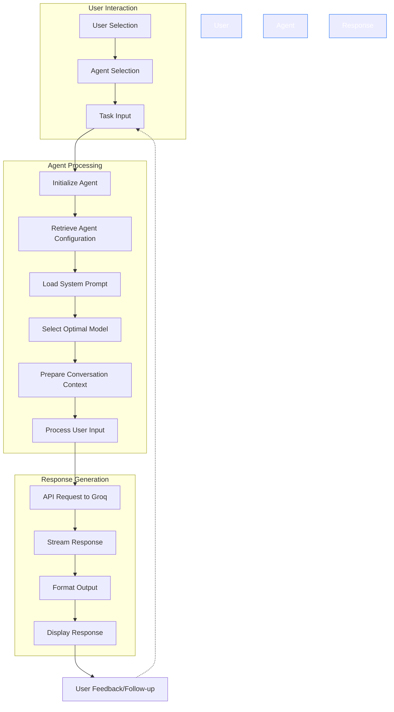
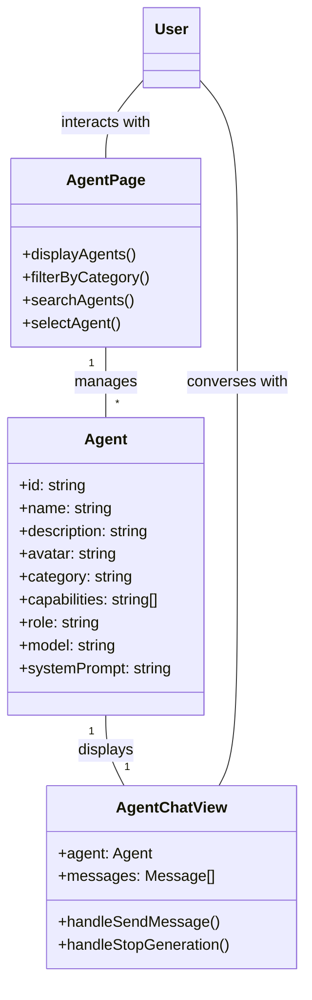

# Specialized Agent Workflow Diagram

The specialized agents in Skynet AI Assistant provide domain-specific expertise through tailored system prompts and optimized models for particular tasks.

## Agent Interaction Workflow



## Agent Components and Relationships



## Detailed Agent Workflow Process

1. **Agent Selection**:
   - User browses available agents by category or search
   - Each agent displays its capabilities and specialization
   - User selects an agent based on their specific needs

2. **Agent Configuration**:
   - System loads agent's specialized system prompt
   - Configures the appropriate model (e.g., Llama 70B for general tasks, DeepSeek R1 for reasoning)
   - Prepares initial context with agent's role and capabilities

3. **Conversation Initialization**:
   - Agent introduces itself with a welcome message
   - Explains its capabilities and how it can assist
   - Prompts the user for specific input related to its domain

4. **Request Processing**:
   - User's message is combined with the agent's system prompt
   - The complete context is sent to the selected AI model via Groq API
   - Response is streamed back character by character for a natural typing effect

5. **Response Handling**:
   - Output is formatted with appropriate syntax highlighting for code
   - Markdown rendering for structured content
   - Special formatting based on agent type (e.g., data visualization for the Data Sage)

6. **Conversation Continuation**:
   - User can follow up with additional questions
   - Agent maintains context throughout the conversation
   - User can provide feedback on responses

## Technical Implementation

```typescript
// Agent chat implementation (simplified)
const handleSendMessage = async () => {
  if (!input.trim() || isLoading) return;

  // Create user message
  const userMessage = {
    id: crypto.randomUUID(),
    role: 'user',
    content: input.trim(),
    timestamp: new Date()
  };

  // Add to conversation
  setMessages(prev => [...prev, userMessage]);
  setIsLoading(true);
  
  // Create empty assistant message for typing indicator
  const assistantMessageId = crypto.randomUUID();
  const emptyAssistantMessage = {
    id: assistantMessageId,
    role: 'assistant',
    content: '',
    timestamp: new Date()
  };
  
  // Add empty message for typing indicator
  setMessages(prev => [...prev, emptyAssistantMessage]);
  
  // Get the agent's prompt and generate a response
  generateAgentResponse(input.trim(), agent, assistantMessageId);
};
```

## Agent System Architecture

Each specialized agent is defined with:

1. **Identity Components**:
   - Unique identifier and name
   - Visual representation (avatar icon)
   - Role description and category

2. **Capability Definition**:
   - List of specific capabilities
   - Specialized domain knowledge
   - Preferred AI model for optimal performance

3. **Behavioral Control**:
   - Custom system prompt that shapes its responses
   - Example dialogues for consistent behavior
   - Response formatting guidelines

The agent system is designed for extensibility, allowing new specialized agents to be added easily by defining their configuration and system prompts.