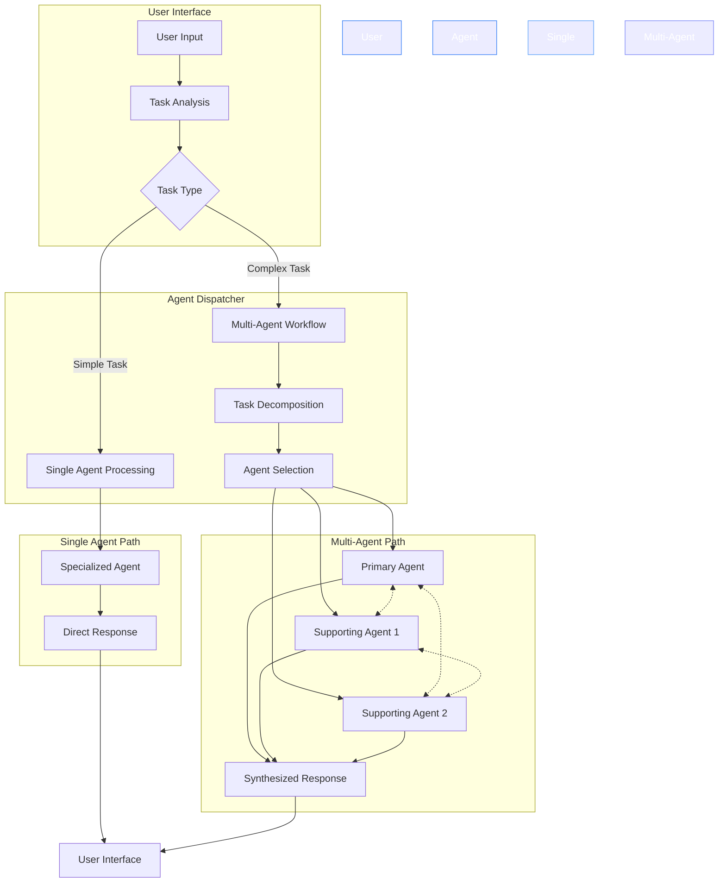
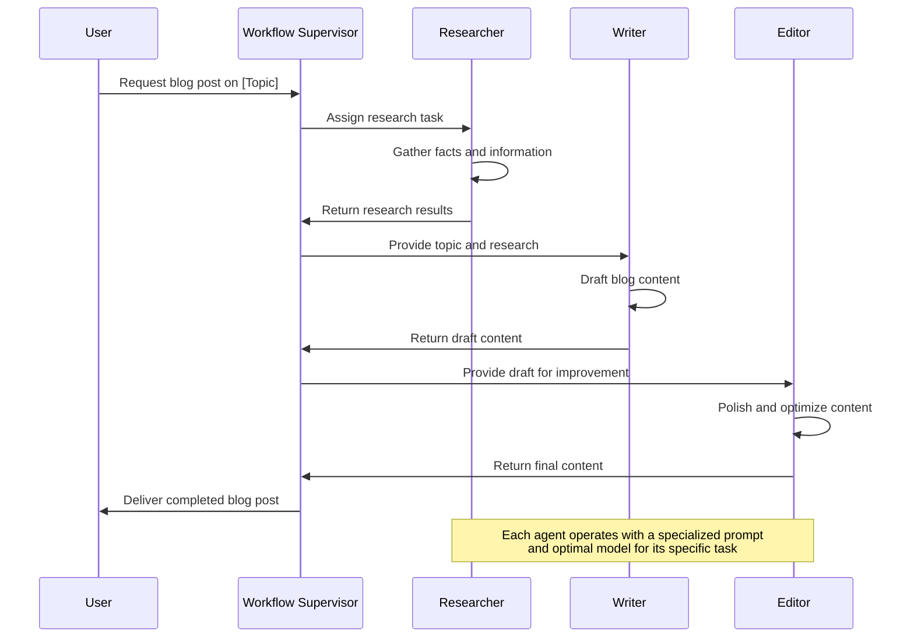
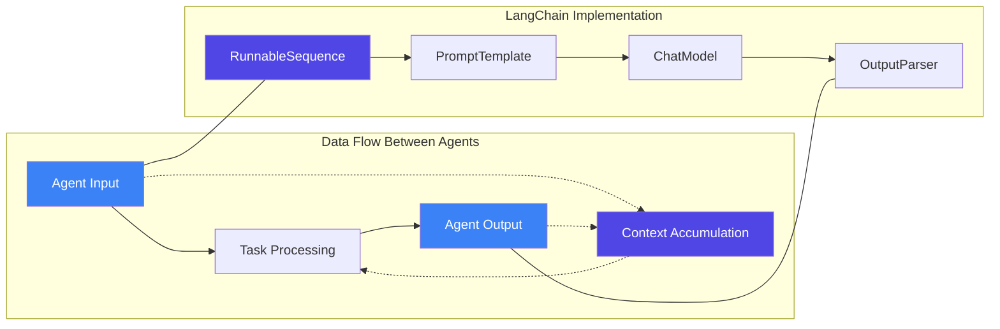
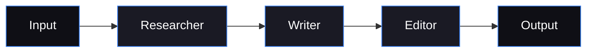
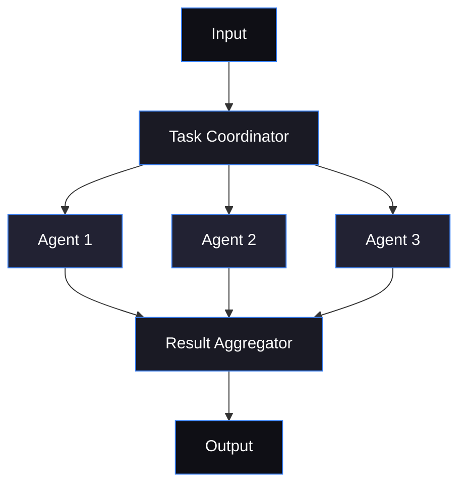
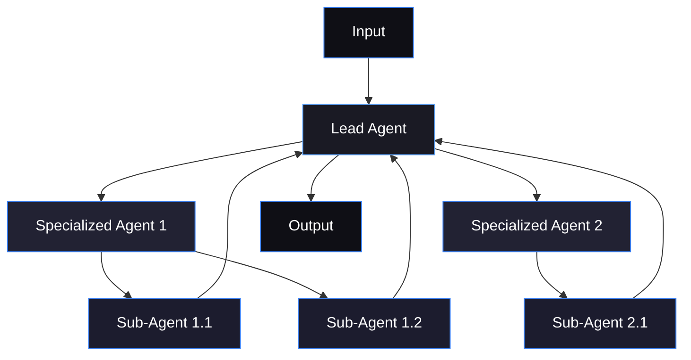

# Multi-Agent Collaboration Diagram

This diagram illustrates how multiple agents can collaborate to solve complex problems in the Skynet AI Assistant system.

## Agent Collaboration Architecture

## Superagent Blog Creation Workflow

## Agent Communication Pattern

## Multi-Agent Interaction Types

### Sequential Workflow (Pipeline)
Used in the Blog Creation Superagent:

### Parallel Processing
For independent subtasks:

### Hierarchical Collaboration
For complex problem-solving:

## Implementation Details

The multi-agent system in Skynet is implemented using:

1. **CrewAI-inspired architecture**: 
   - Defines a Crew of specialized agents
   - Each agent has a specific role and system prompt
   - Agents communicate through context sharing

2. **LangChain integration**:
   - Uses RunnableSequence for chain composition
   - PromptTemplates for dynamic prompt creation
   - Modular design for agent substitution

3. **Context management**:
   - Shared context is passed between agents
   - Each agent contributes to and builds upon the context
   - Final output synthesizes all agent contributions

This architecture enables flexible agent collaboration patterns that can be adapted to different types of complex tasks.