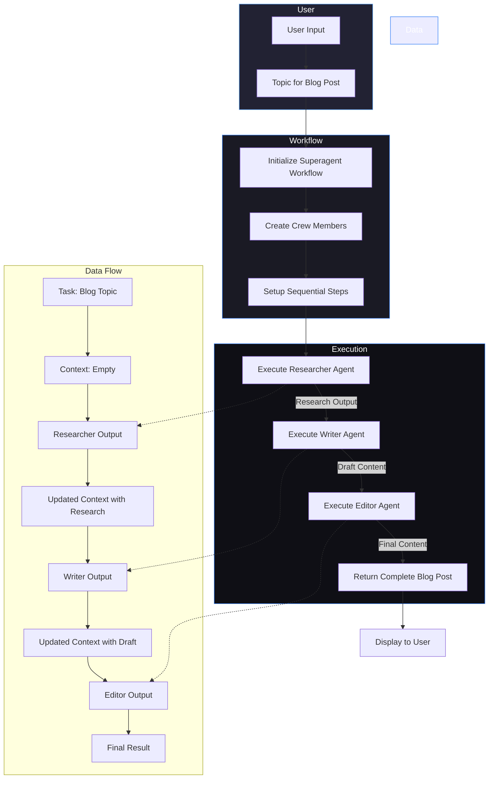

# Superagent Workflow Diagram

The Superagent system in Skynet AI Assistant implements a sequential multi-agent workflow where specialized AI agents collaborate to complete complex tasks.

## Blog Creation Superagent Workflow



## Detailed Process Flow

1. **User Input**:
   - User enters a topic for blog creation
   - The workflow is initialized with this input

2. **Crew Setup** (from `createBlogCrewWorkflow`):
   - `Researcher`: Specialized in gathering facts and information
   - `Writer`: Creates engaging content from research
   - `Editor`: Polishes and optimizes the final content
   - Each crew member is assigned a specific model optimized for their task

3. **Sequential Execution**:
   - Step 1: The Researcher analyzes the topic and produces research output
   - Step 2: The Writer takes both the original topic and research to create draft content
   - Step 3: The Editor refines the draft into a polished final output
   - Each step updates the context that's passed to the next agent

4. **Progress Tracking**:
   - The UI displays the current active agent
   - Intermediate outputs are shown as they're completed
   - Progress indicators show workflow position

5. **Result Delivery**:
   - Final output is formatted using Markdown
   - User can view and copy the complete blog post

## Technical Implementation

```typescript
// High-level implementation summary of the Crew class
export class Crew {
  name: string;
  description: string;
  members: CrewMember[];
  
  // Execute a sequential workflow where each member builds on the previous
  async executeSequentialWorkflow(
    initialTask: string,
    callback?: (member: CrewMember, output: string) => void
  ): Promise<string> {
    let context = "";
    let result = "";
    
    for (const member of this.members) {
      try {
        // Each agent executes with the accumulated context
        result = await member.executeTask(initialTask, context);
        
        // Update context with this agent's output for the next agent
        context += `\n\n${member.name} (${member.role}) output:\n${result}\n\n`;
        
        // Notify UI of progress through callback
        if (callback) {
          callback(member, result);
        }
      } catch (error) {
        console.error(`Error in workflow at member ${member.name}:`, error);
        throw error;
      }
    }
    
    return result;
  }
}
```

The key strength of the Superagent workflow is its sequential nature, where each specialized agent builds upon the work of previous agents, creating a process pipeline that produces superior results compared to any individual agent working alone.